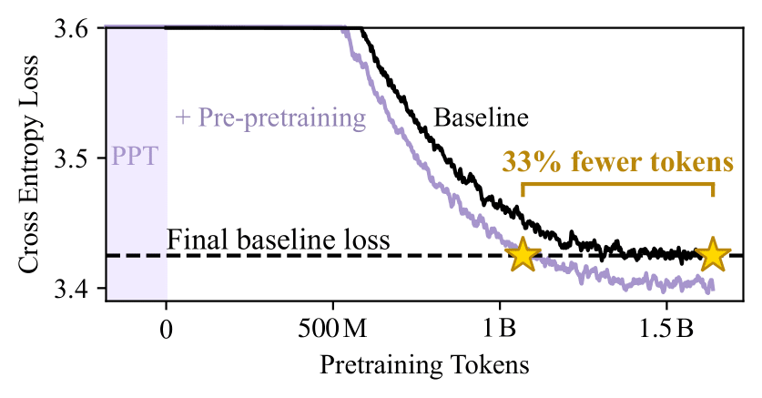

# Between Circuits and Chomsky: Pre-pretraining on Formal Languages Imparts Linguistic Biases

Increase pre-training token efficiency by pre-pretraining on formal languages first!




<a href="https://arxiv.org/abs/2502.19249" style="font-size: 20px;">arXiv</a>


## Installing dependencies
```bash
git clone https://github.com/michahu/pre-pretraining.git
cd pre-pretraining/
pip install -r requirements.txt
```

## Usage
For a minimal reproduction:
```bash
bash scripts/make_ppt_data.sh
bash scripts/train.sh
```

For this minimal reproduction on wikitext, you should see the following:
1. The pre-pretrained model loss starts off higher, then catches up to no pre-pretraining by around 3k steps.
2. After 3k steps, pre-pretraining is better.
   
To reproduce our experiments, change `wikitext` to `allenai/c4` in the scripts above (download time will be slightly longer).

This is how the repo is organized:
- Formal language pre-pretraining data generation: `src/grammar.py`
- Training: `train.py`
- Pruning: `modeling_ppt_neox.py` and `prune.py`
- Evals: `eval_checkpoint.py`
- Ablations data generation: `src/utils.py`


## Citation
```
@misc{hu2025circuits,
      title={Between Circuits and Chomsky: Pre-pretraining on Formal Languages Imparts Linguistic Biases}, 
      author={Michael Y. Hu and Jackson Petty and Chuan Shi and William Merrill and Tal Linzen},
      year={2025},
      eprint={2502.19249},
      archivePrefix={arXiv},
      primaryClass={cs.CL},
      url={https://arxiv.org/abs/2502.19249}, 
}
```

## Contact
Feel free to create an issue or email Michael Hu (<myh2014@nyu.edu>)
